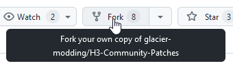
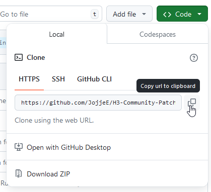
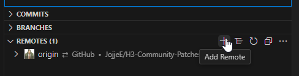
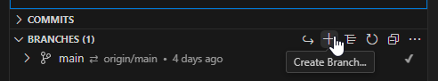
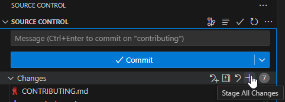
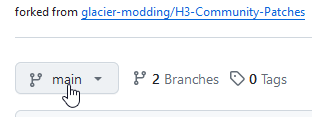
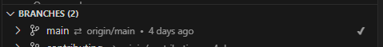
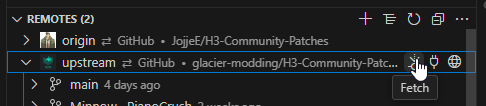
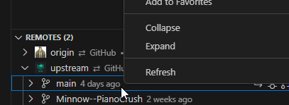

# Contributing your fixes to this project

We think it's great you want to contribute to the community effort! Here is a rundown of what you have to do, to get started. Git can be daunting at first but don't worry, just follow these steps and you'll get along with it quite well.

## Preparation

First begin by creating a GitHub account, if you haven't already, and install Git on your operating system. For Windows, get the [standalone installer here](https://git-scm.com/download/win) or, if you have winget, install it with `winget install --id Git.Git -e --source winget`.

You may need to restart your computer after installing Git to make sure it recognizes the `git` command.

Second, you need to install NodeJS on your operating system. The SMF mod template this project uses, needs NodeJS to function properly. You can download the latest LTS release [on the NodeJS website](https://nodejs.org/en).

With these prerequisites done with, let's get to work with our contributions.

## Fork the repository

You do not have write access to this repository - but you don't need it. GitHub allows you to create a copy just for you that you can work with, this is called a _fork_.

On the front page of the repository, click the fork button in the header.



The repository name and description will be filled in automatically. You don't need to change any settings here, simply click **Create fork** to continue. GitHub will work for a minute and soon enough you will be in a _fork_ of the Community Patches project, saved under your own username. Click the green **Code** button, and click the clipboard button next to the repository URL.



Now, open your Simple Mod Framework mods folder. If you have the Community Patches mod downloaded already, enter the `GlacierOrganisation.CommunityPatches` folder, and **delete all files and folders inside**. If you don't have the mod downloaded, create a folder named `GlacierOrganisation.CommunityPatches`, then enter the folder.

Open a command prompt or terminal in this folder. Run the command `git clone <repository URL> .`
Paste in the URL you copied from GitHub as the URL. **The space and the period at the end is important**. Give the command prompt a minute to work while it downloads all the files.
When it's done we also want to add the original GitHub repository as a source, or _remote_, so we can easily get updates from it, what we call _syncing the fork_.

Run the command `git remote add upstream https://github.com/glacier-modding/H3-Community-Patches.git`. Another way to do this, if you use VSCode, is to add a remote in the _Source Control_ tab after you have loaded the folder into VSCode.



If you add it through VSCode enter the name first which you can call `upstream`, hit enter, then paste in the URL and hit enter again.

## Last prep for development

Still in the command prompt in the `GlacierOrganisation.CommunityPatches` folder, run the command `npm install`. Wait for it to finish, which may take a while, then run `npm run prepare`.
Before you get cracking on contributing you should make a new branch on your repository.

From here on the guide will not be using the command line, instead opting to show visually in VSCode how to use Git.

In VSCode, open the _Source Control_ tab on the left and open the Branches folder. You'll see you are currently in the main branch. Click the plus sign to make a new branch.



VSCode prompts you to name the new branch. Name it something descriptive related to what you are contributing. Like `documentation-fix` or `sunglasses-fix` or something. Press Enter, then choose Create & Switch to Branch.

_Now_ you can get to developing in the mod. Open it in GlacierKit, add your files, your stuff, whatever work you are doing! And if this is your first contribution, why not add yourself to the list of authors in the `manifest.json`?

If you're looking for things to do why not consult the [issues page](https://github.com/glacier-modding/H3-Community-Patches/issues)?

## Commit your changes

When you're finished making your fix it's time to contribute to the project. Open VSCode and open the _Source Control_ tab. You will see a list of all the files you've modified. We need to tell Git what files we want to contribute, this is called _staging_. You can pick and choose what files to stage or you can click the plus button right by Changes to stage all the files.



When you've staged the changes you want to contribute, write a commit message in the text box. It's important that this commit message follows the [conventional commit](https://www.conventionalcommits.org/en/v1.0.0/#examples) standard. Here's some examples of good commit messages:

```
feat: fix eyeglasses having sunglasses material
feat: update the manifest
feat: add phone fixes
```

Maybe you're wondering why we don't use `fix:` instead of `feat:`. This is because, for this project, we use `fix:` to notate when we're fixing a piece of the mod that doesn't work properly. "Fixing" a part of the game is a _feature of the mod_. Hence we use `feat:` for our commits the majority of the time.

If you want to add more details to your commit message you can. Simply hit enter twice to make new lines. Here's an example:

```
feat: Roll back other suit part mdls with inverted normals

Same story as before, IOI screwed the normals up but I could extract the chunk0 variant which look fine.
```

The first line in a commit message is a header. You don't need a description if the header explains everything you did in your commit.

When you're satisfied with your message, click the big **Commit** button. After this you can click **Sync Changes** to send your commit up to GitHub's servers.

## Opening our pull request

With your commits in the cloud, open your GitHub repository. Click your profile picture in the top right and click **Your repositories**. Find your Community Patches repo and enter it.

You will be in the main branch automatically. If you just commited your changes, GitHub will show a yellow box, letting you know that you recently made pushes. In that case, click the big green button in the yellow box named **Compare & pull request**.

If you _don't_ see this yellow box, find the new branch you made your changes to, by clicking the branch dropdown button, and picking it from the list.



Then in your new branch click the **Contribute** button and choose **Open pull request**.

The title of your pull request will automatically be derived from your commit message header. Any description you wrote will be filled in as well, you can add more information to your pull request here that would be good for the project maintainers to know.

If everything looks good, click **Create pull request**!

Maintainers of the project will examine your work and if all looks well your pull request will be approved and your work will be merged into the mod.

After your branch has been merged it is safe to delete the branch in your repository.

## Get updates from upstream

You will need to manually keep your fork updated. Whenever the mod gets an update, you should make sure you are in the main branch, and _rebase_ from upstream. This will pull in all changes that have been made and _sync your fork_, like we talked about earlier.

The fastest and easiest way is to go onto GitHub and open your fork of the repository. Just under the commit history on the front page you will see a gray bar reading "This branch is X commits behind ......". Click the **Sync fork** button, have a look at the changes and confirm with clicking **Update branch**. And that's it!

You can also do it locally, without going onto GitHub. The fastest way to do this is to run these 4 commands in a row, in the `GlacierOrganisation.CommunityPatches` folder in a command prompt or terminal.

```
git fetch upstream
git checkout main
git rebase upstream/main
git push origin main --force
```

Note that rebase might cause you to lose work so it's important that you always develop in your own branch and never in the main branch.

If you can't remember these commands you can do it in VSCode as well, like this:

In _Source Control_ make sure you are in the `main` branch first.
You can see what branch you are currently in by a checkmark under Branches. Switch to it if you have to.



Click the **Fetch** button on the upstream remote.



Expand the upstream remote and right click the `main` branch.



In the right click context menu choose the option **Rebase Current Branch onto Branch...** Choose **Rebase** in the popup to confirm.

Git will automatically make commits and you can now click **Sync Changes** to push the changes to GitHub as well. Your fork is now up to date.
